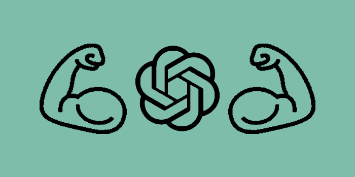
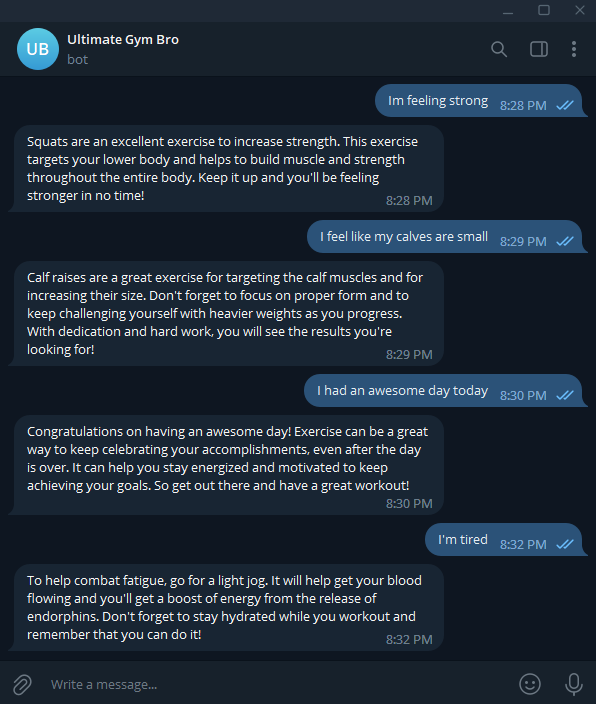

<br />
<div align="center">
  <a href="https://github.com/github_username/repo_name">
    
  </a>

<h3 align="center">Ultimate Gym Bro</h3>

  <p align="center">
      GPT agent with the personality of a gym trainer
    <br />
    <a href="https://hmolavi.com/ultimate-gym-bro-chat/">View Website Demo</a>
  </p>
</div>
<div align="center">
</div>

----
## Available on Telegram

<div align="center">
  
</div>

# Getting Started
You can run the module on your device or through Repl

## Running in Replit
Go to my Repl repository and deploy by running this into the shell terminal
``` bash
deploy.py
```
## Running on Localhost

Initially you need to setup a Python virtual environment. You can do so by running the following:

```bash
python3.8 -m venv .venv
source .venv/bin/activate
python3.8 -m pip install -r requirements.txt
```

Then, run your agent:

```bash
python3.8 main.py
```

## Roadmap

- [x] Build api foundation
- [x] Create new Telegram bot and access token
- [x] Steamship
  - [x] Download SDK
  - [x] Connect API
  - [x] Create instance
  - [x] Link Telegram Bot
- [ ] Launch on Repl
- [ ] Add pictures
  - [x] Set foundation
  - [ ] Specify picture prefrences
  - [ ] Connect to DALL-E
     
## Contributing
Contributions are what make the open source community such an amazing place to learn, inspire, and create. Any contributions you make are **greatly appreciated**.

If you have a suggestion that would make this better, please fork the repo and create a pull request. You can also simply open an issue with the tag "enhancement".
Don't forget to give the project a star! Thanks again!

1. Fork the Project
2. Create your Feature Branch (`git checkout -b feature/AmazingFeature`)
3. Commit your Changes (`git commit -m 'Add some AmazingFeature'`)
4. Push to the Branch (`git push origin feature/AmazingFeature`)
5. Open a Pull Request
